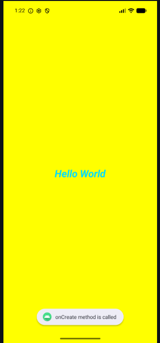
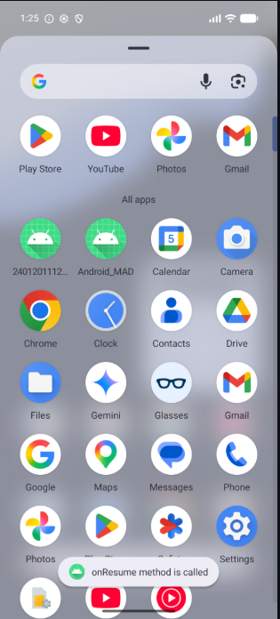
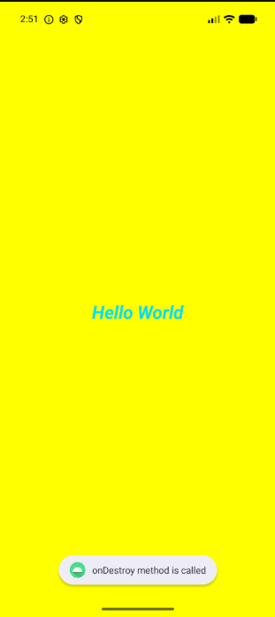
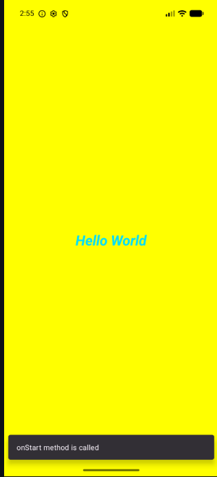
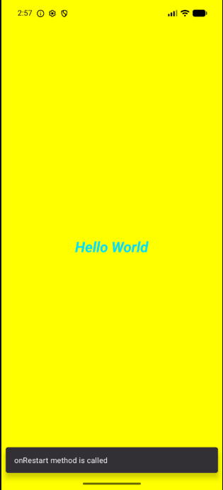

# Practical-2: Activity Lifecycle & Basic UI

## Aim

Develop an Android application to understand the **Activity Lifecycle** and demonstrate basic Android UI design. The application displays lifecycle events using **Logcat**, **Toast messages**, and **Snackbar messages**.

---

## Objective

The main objectives of this practical are:

- To understand the Android Activity Lifecycle.
- To implement different lifecycle methods.
- To observe lifecycle events using Logcat.
- To display lifecycle events using Toast messages.
- To display lifecycle events using Snackbar messages.
- To create and style a basic Android user interface.

The Activity Lifecycle methods demonstrated are:

- `onCreate()`
- `onStart()`
- `onResume()`
- `onPause()`
- `onStop()`
- `onRestart()`
- `onDestroy()`

---

# Output Screenshots

## 1. Main UI – onCreate

The application starts with a yellow background and displays **Hello World** in the center of the screen. A Toast message is also displayed when the `onCreate()` method is called.



---

## 2. Logcat Output

The following screenshot shows the Activity Lifecycle events recorded in **Logcat**.


---

## 3. Toast Messages

Toast messages are displayed when different Activity Lifecycle methods are executed.

### onCreate()


### onResume()



### onDestroy()



---

## 4. Snackbar Messages

Snackbar messages are displayed at the bottom of the application screen for different lifecycle events.

### onStart()



### onResume()


### onRestart()



---

## 5. onDestroy Output

The following screenshot shows the message displayed when the Activity is destroyed.


---

## 6. Complete Lifecycle Screenshots

The following screenshots demonstrate the different Activity Lifecycle states:

### onCreate


### onStart


### onResume


### onPause / Resume


### onRestart


### onDestroy


---

# User Interface

The application uses **ConstraintLayout** to create the user interface.

### UI Features

| Property | Value |
|----------|-------|
| Layout | ConstraintLayout |
| Background | Yellow (`#FFFF00`) |
| Text | Hello World |
| Text Position | Center |
| Text Size | `27sp` |
| Text Color | Holo Blue Bright |
| Text Style | Bold & Italic |

---

# Activity Lifecycle Implementation

The lifecycle methods are implemented inside `MainActivity.kt`.

A common `display()` function is used to show lifecycle messages through **Logcat**, **Toast**, and **Snackbar**.

```kotlin
private fun display(msg: String) {
    Log.i("MainActivity", msg)

    Toast.makeText(
        this,
        msg,
        Toast.LENGTH_SHORT
    ).show()

    Snackbar.make(
        findViewById(R.id.main),
        msg,
        Snackbar.LENGTH_SHORT
    ).show()
}
